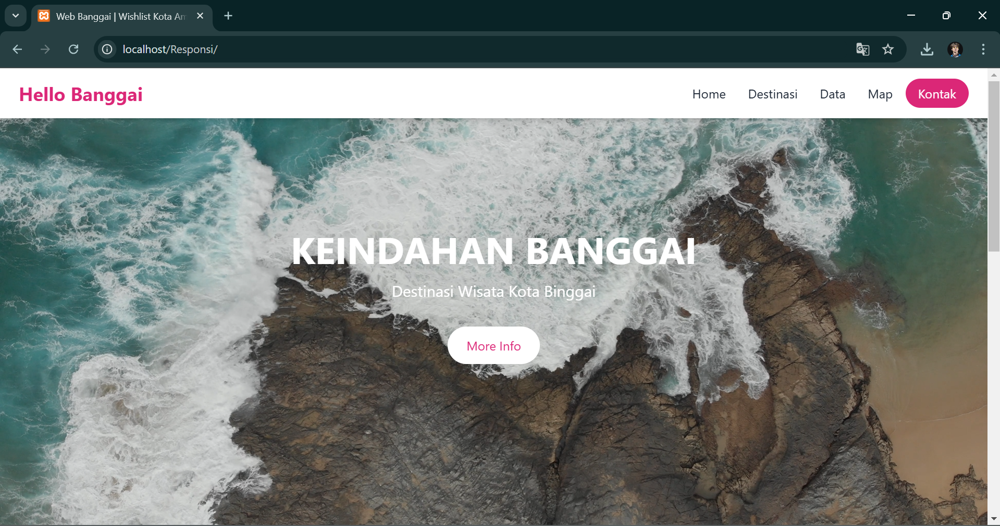
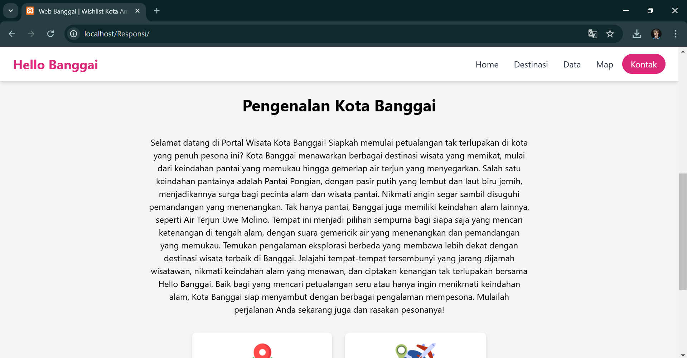
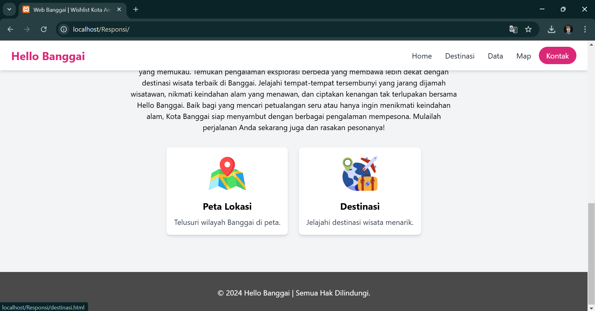
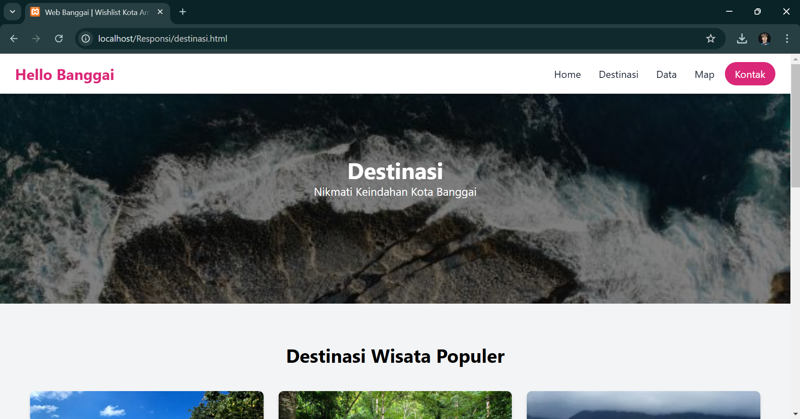
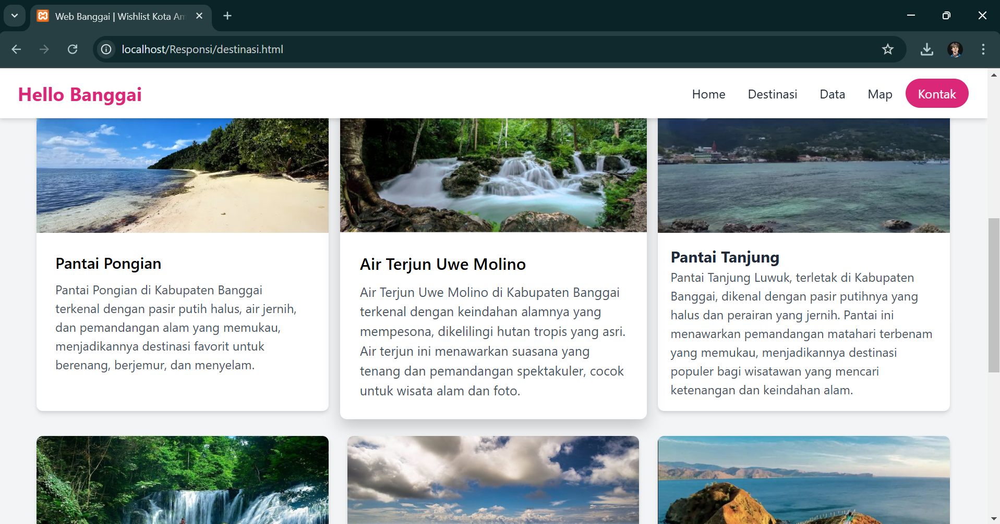
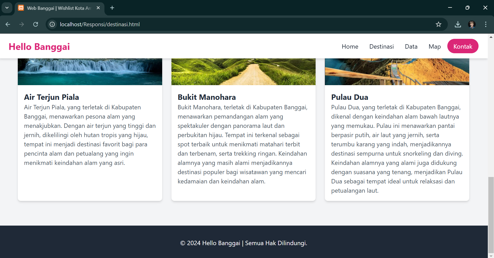
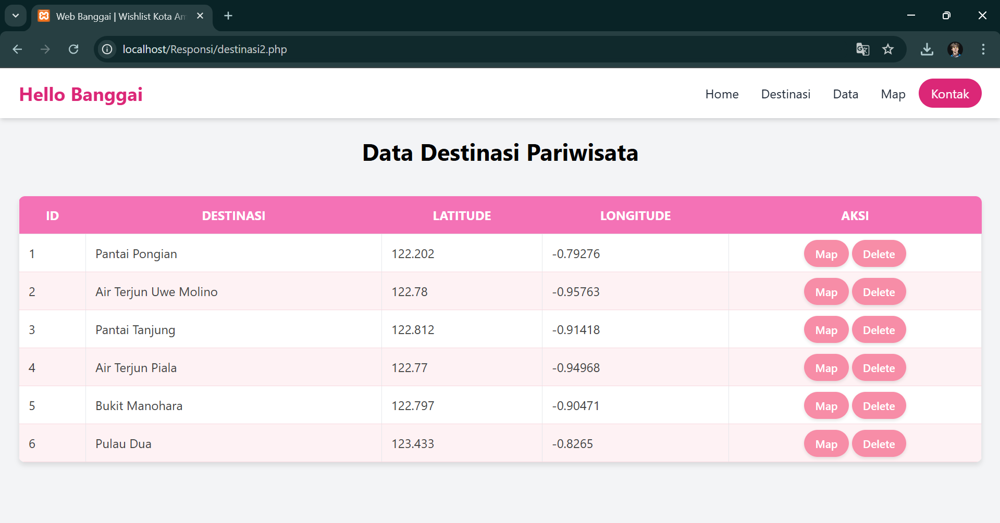
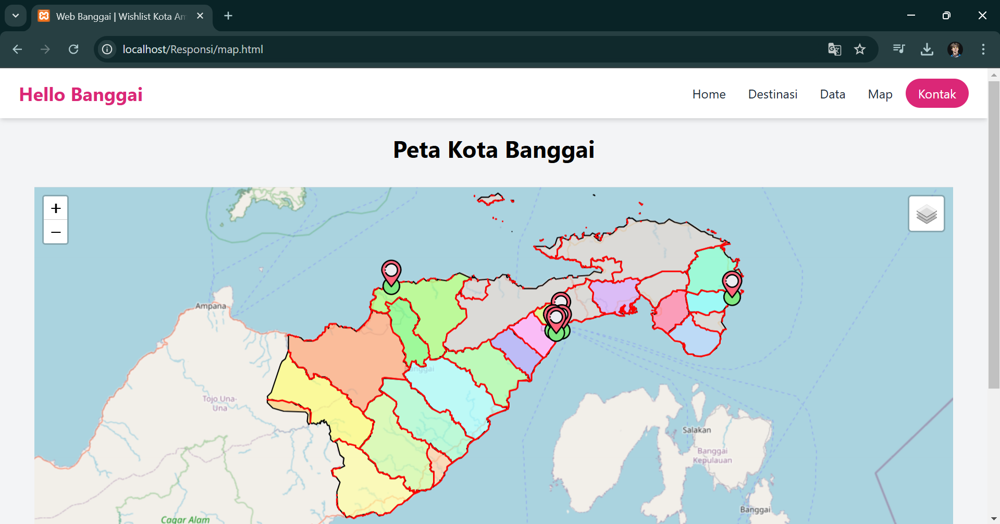
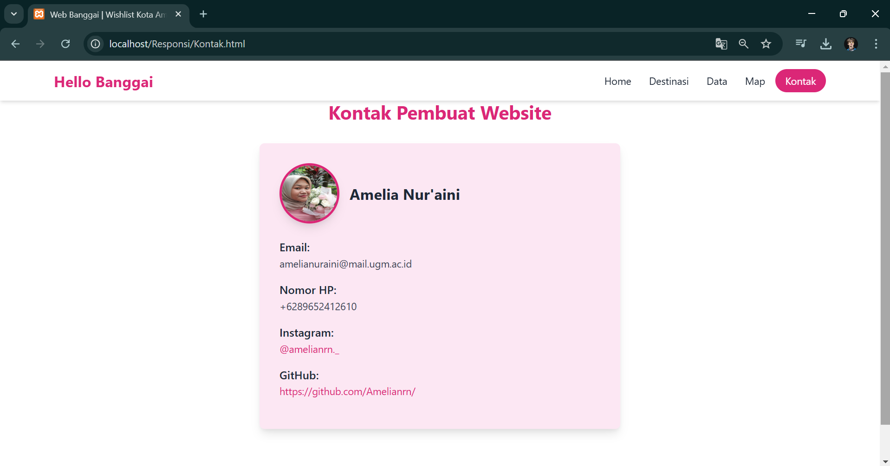

# HELLO BANGGAI  

---

## Nama Produk  

**HELLO BANGGAI**  

---

## Latar Belakang

**Kabupaten Banggai** memiliki keindahan alam dan budaya yang melimpah, namun banyak destinasi wisata belum dikenal luas karena minim publikasi dan sulit diakses informasinya. Web GIS Pariwisata menjadi solusi untuk mempromosikan potensi daerah dengan menyajikan informasi lokasi, destinasi wisata, dan daya tarik wisata secara interaktif. 

---

## Deskripsi Produk  

**HELLO BANGGAI** adalah aplikasi peta interaktif berbasis web yang menampilkan informasi spasial wilayah Banggai. Aplikasi ini memanfaatkan teknologi **Leaflet.js** untuk menampilkan peta interaktif, serta data spasial dalam format **GeoJSON**. Fitur seperti peta interaktif, marker lokasi, pop-up informasi, dan layer wilayah administratif membantu pengguna menjelajahi lokasi penting dan batas wilayah dengan mudah.  

---

## Komponen Pembangun Produk  

### Frontend  

- **HTML5**: Struktur dasar halaman web.  
- **CSS3**:  
  - **Tailwind CSS**: Framework CSS untuk desain yang efisien, fleksibel, dan modern.  
- **JavaScript**:  
  - **Leaflet.js**: Library untuk peta interaktif.  

### Backend  

- **PHP**: Untuk pengelolaan database dan operasi backend.  
- **MySQL**: Database untuk menyimpan data lokasi dan koordinat.  

### Tools dan Libraries Lainnya  

- **GeoJSON**: Format data spasial untuk layer peta.  
- **OpenStreetMap**: Penyedia tile layer untuk peta dasar.  

---

## Sumber Data  

1. **GeoJSON**:  
   - Data spasial meliputi batas wilayah administratif dan titik lokasi wisata di Banggai.  
2. **OpenStreetMap**:  
   - Sumber peta dasar.  
3. **Database MySQL**:  
   - Tabel **pariwisata** dengan kolom:  
     - `id`: ID unik lokasi.  
     - `destinasi`: Nama destinasi wisata.  
     - `latitude`: Koordinat lintang.  
     - `longitude`: Koordinat bujur.  

---

## Tangkapan Layar Komponen Penting pada Website

### Home Page

### Destinasi Page

### Data Page

### Map Page

### Kontak

---

## Contact  

- **Pengembang**: [Amelia Nur'aini]  
- **Email**: [amelianuraini@mail.ugm.ac.id]  

---